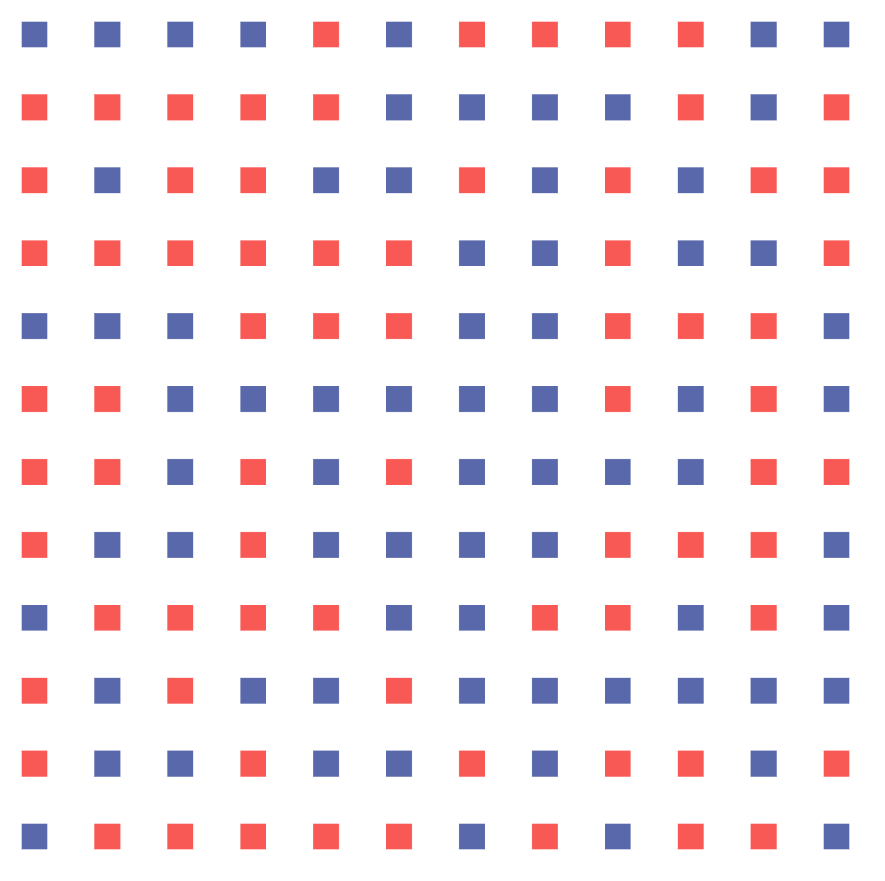
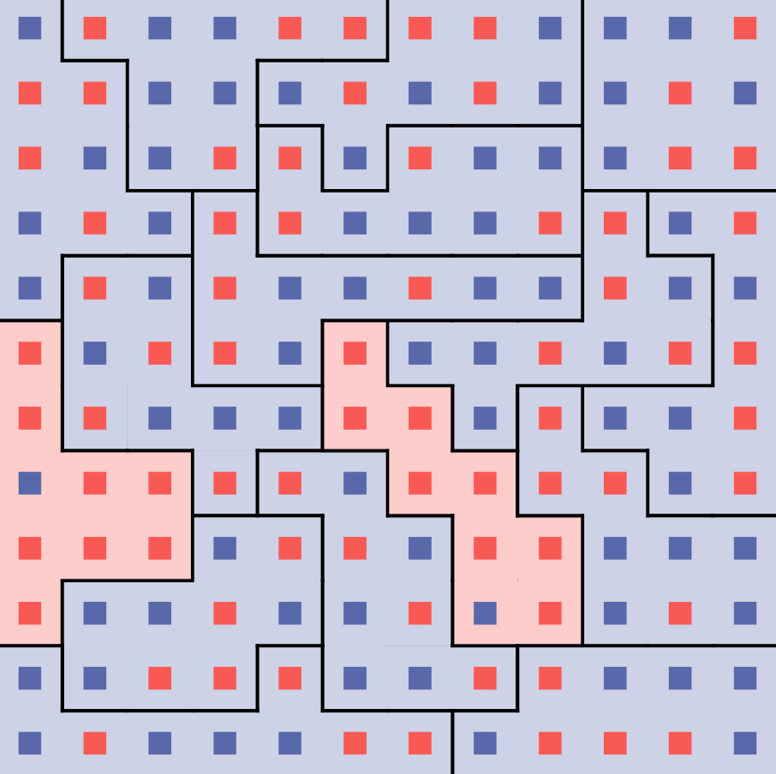
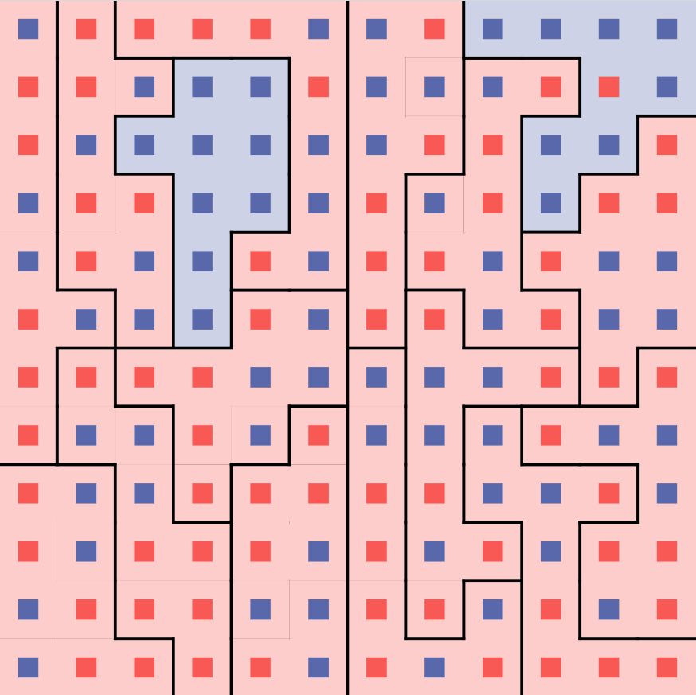
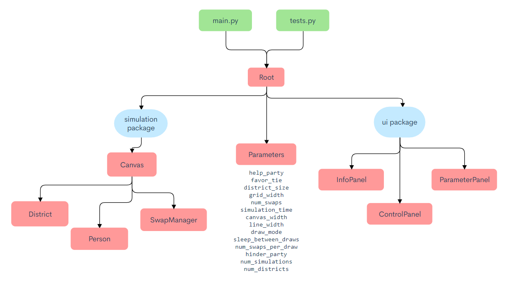

# Gerrymandering
A program that draws district lines around a two-party grid of people (equal proportions for each party) in order to
give an unfair advantage to one party.



Above is a grid of people, each colored by which party they vote for. There are 288 blue people and 288 red people.


Districts are groups of people (16 people in this case) enclosed in black lines, shaded by winner (which party has more
people in the district).



We can draw the district lines in such a way that gives blue 31 districts and red only 5.



This is the **same grid** but with lines drawn so that red has 31 districts and blue only has 5.

## Usage
Download the project and run `python main.py` in the directory. Only python3 standard library is required. Close other
apps and turn off battery saver to get the best performance.

## How It Works
### Overview
First, a grid of people is generated, with parties that are randomized while ensuring that there are an equal amount of
people in each party. Districts are then drawn around those people. Districts are initially squares of size
`district_size`, and we ensure that `grid_width` and `district_width` allow this to be possible. From there, we perform
a series of swaps of people between districts. These swaps will over time give one party (specified by `help_party`)
more and more districts, without changing the people grid.

### Swapping
We pick 2 districts, `district1` and `district2` that are touching by 2 or more people. We also pick a person from each
of those districts (`person1` and `person2`), using certain conditions to ensure that the swap not hinder the wrong
party or cause disconnections in the districts. More information about these conditions can be found in `get_person1`
and `get_person2` methods in `simulation/swap_manager.py`.


We can then make `person1` part of `district2`, and `person2` part of `district1`. 


In this example, we have flipped one district from being tied to being blue.

### Code structure


## Roadmap & Contributing
You can find a todo list at the top of the `main.py` file. I am always trying to make the program faster and better at
gerrymandering. By doing this, we can get to the ideal gerrymandered state faster, and scale up the grids and district
sizes. You can measure how good the program is in a given version using [testing](##testing). Other things on the
roadmap (can be found in todo in `main.py`) are making a UI, porting to website(?), >2 parties support, making people's
parties more clumped together to resemble reality better. PR's, feedback, and general insight are much appreciated.

## Testing
Run `python tests.py`. This runs two simulations, one that figures out how much time is spent doing swaps (see
[Swapping](###swapping)) called avg_time, and another that takes the average score after a certain number of swaps
called avg_score. It also prints the parameters used to run each of these simulations, set in file `tests.py`. These
results can be compared with other versions, and the most recent results for the current version are at the bottom of
this file. Keep in mind that the avg_time varies greatly different machines.

## Test results for this version
```
avg_time:  72.4168 ms
avg_score:  29.09
score parameters: Parameters(help_party=blue, favor_tie=False, district_size=16, grid_width=24, canvas_width=640, line_width=3, draw_mode=normal, sleep_between_draws=0, num_swaps_per_draw=2000, num_swaps=1000, simulation_time=None, hinder_party=red, num_simulations=10, num_districts=36.0) x 50 processes
time parameters: Parameters(help_party=blue, favor_tie=False, district_size=16, grid_width=24, canvas_width=640, line_width=3, draw_mode=normal, sleep_between_draws=0, num_swaps_per_draw=2000, num_swaps=1000, simulation_time=None, hinder_party=red, num_simulations=150, num_districts=36.0)
 ```
